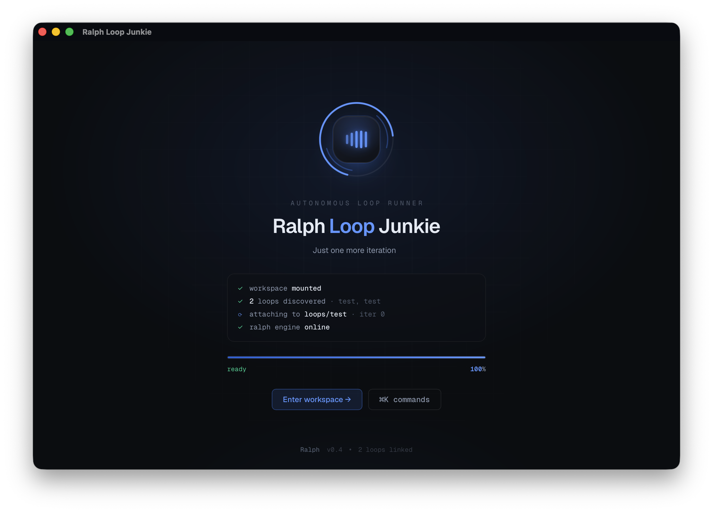
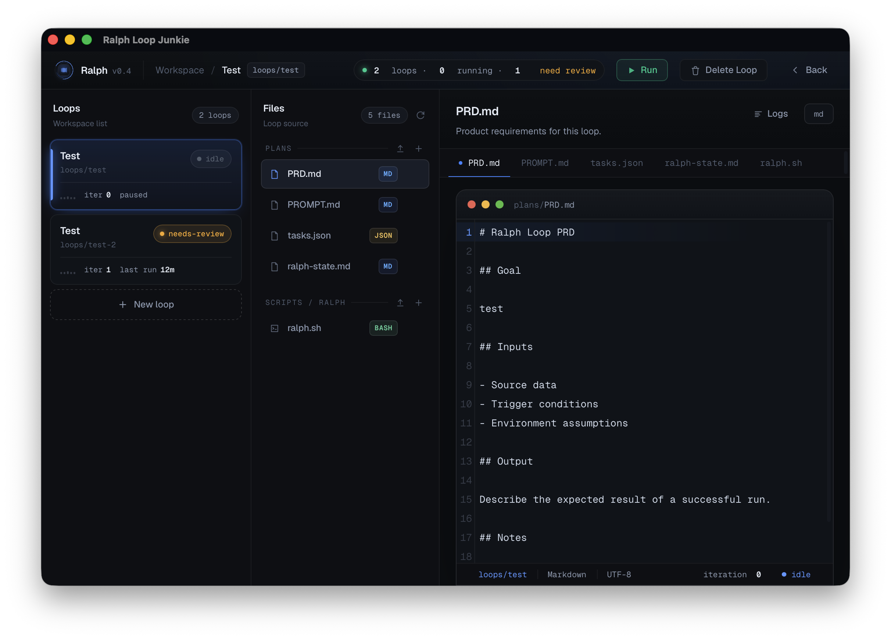

# Ralph Loop Junkie

> Just one more iteration.

A desktop app for people who love running **Ralph loops** — autonomous Claude
agent loops that keep iterating on a task until it's done. Manage multiple loop
workspaces, edit their plans and scripts in a built-in editor, run them, and
watch the output stream live. Comes with a small companion CLI.

Built with React + TypeScript + Vite on the front end and Tauri 2 (Rust) on the
back end.





---

## What's a Ralph loop?

A Ralph loop is a shell script that re-spawns a fresh agent session every
iteration, pointed at a small set of plan files, and keeps going until the work
is complete. Each loop is a self-contained workspace:

```
<loop-id>/
├── plans/
│   ├── PRD.md           # what the loop should accomplish
│   ├── PROMPT.md        # instructions for the agent
│   ├── tasks.json       # the task list (status drives completion)
│   └── ralph-state.md   # the loop's working memory across iterations
└── scripts/ralph/
    └── ralph.sh         # the loop entrypoint
```

Each iteration `ralph.sh`:

1. Invokes an agent CLI against the plan files. The default script calls
   `claude --print`, but `ralph.sh` is just a shell script — swap in whatever
   non-interactive agent CLI you use (Codex, an OpenRouter-backed CLI, etc.).
2. Has the agent pick the next unfinished task, do the work, and mark it `done`
   in `tasks.json`.
3. Runs a verification command (`true` by default — swap in your test command).
4. Re-reads `tasks.json` and exits when **every** task is `done` and
   verification passes (it does not trust a self-reported "complete" — it checks
   the actual task statuses).

New loops are seeded with a minimal working example whose only task is to say
`Hi, I'm a loop`, so you can run one end-to-end immediately.

---

## Features

- **Three-panel workspace** — loops list, file browser, and a CodeMirror editor.
- **Animated splash** landing screen.
- **Loop lifecycle** — create, rename, run, stop, delete, and "mark reviewed".
- **Status at a glance** — `idle` / `running` / `needs-review` badges, animated
  heartbeat for running loops, and counts in the top bar.
- **Live logs** — a drawer streams each loop's stdout/stderr as it runs.
- **File management** — add, rename, delete, and **upload** files (or drag &
  drop onto a folder). Images render inline in the editor.
- **tasks.json helper** — an "Add task" button appends a new task object.
- **Disk sync** — files are re-read from disk while a loop runs and when it
  ends, so edits the loop makes show up live.
- **Menu bar tray** — shows total / running / needs-review counts; closing the
  window hides to the tray so loops keep running. Quit from the tray menu.
- **Command palette** — `⌘K`.
- **Companion CLI** — `ralph list`, `ralph run <loop>`, `ralph stop <loop>`.

### Keyboard shortcuts

| Shortcut | Action |
| --- | --- |
| `⌘K` / `Ctrl+K` | Toggle the command palette |
| `⌘R` / `Ctrl+R` | Run / stop the active loop |
| `O` | Open the workspace (from the landing page) |
| `↑` / `↓` | Move between loops / files (↓ past the last loop selects **+ New loop**) |
| `→` / `Enter` | Move from loops → files → editor |
| `Esc` | From the loops column, return to the splash screen |
| `Delete` / `Backspace` | Delete the selected loop or file (with confirmation) |
| Double-click | Rename a loop or file inline |

---

## Requirements

- **Node.js** and **Rust** (stable) with the
  [Tauri 2 prerequisites](https://v2.tauri.app/start/prerequisites/).
- **An agent CLI** that runs non-interactively from the terminal. The default
  `ralph.sh` calls `claude --print`
  ([Claude Code](https://claude.com/claude-code)), but the script is fully
  editable — point it at Codex, an OpenRouter-backed CLI, or any other agent you
  prefer.
- **bash** and **python3** — the default loop script uses them (python3 powers
  the task-completion check).

> Currently developed and tested on **macOS**.

---

## Getting started

```bash
npm install
npm run tauri dev      # run the app in dev mode
```

Build the app bundle:

```bash
npm run tauri build      # produces Ralph Loop Junkie.app
```

The bundle target is set to `app` only, so the build doesn't depend on macOS's
"control Finder" Automation permission (Tauri's DMG step uses AppleScript and
fails without it). To produce a `.dmg` for distribution, run:

```bash
npm run dmg              # packages the built .app into a .dmg via hdiutil
```

Both artifacts land under `src-tauri/target/release/bundle/`.

Loops and their files are stored under the OS app-data directory, e.g. on macOS:

```
~/Library/Application Support/com.ralphloopjunkie.app/loops/
├── loops.json          # the loop manifest (metadata + file contents)
└── <loop-id>/          # one directory per loop (plans/, scripts/ralph/)
```

---

## CLI

A standalone `ralph` binary operates on the same data directory as the app, so
the two stay interoperable.

```bash
# build it
cd src-tauri
cargo build --release --bin ralph

# (optional) put it on your PATH
ln -sf "$PWD/target/release/ralph" /usr/local/bin/ralph
```

Usage:

```bash
ralph list              # list all loops (name, id, status, iteration, last run)
ralph run <id|name>     # run a loop, streaming output to the terminal
ralph stop <id|name>    # stop a running loop
```

Loops are matched by id or name (case-insensitive).

---

## Project layout

```
.
├── index.html
├── src/                # React + TypeScript front end
│   ├── App.tsx         # the whole UI (workspace, splash, editor, loop logic)
│   └── style.css
├── src-tauri/          # Tauri 2 / Rust back end
│   ├── src/
│   │   ├── lib.rs      # commands: write/read/delete files, run/stop loops,
│   │   │               #           manifest load/save, tray status
│   │   ├── main.rs     # app entrypoint
│   │   └── bin/ralph.rs# the companion CLI
│   ├── icons/
│   └── tauri.conf.json
└── package.json
```

---

## Tech

React 19 · TypeScript · Vite · Tauri 2 · Rust · CodeMirror 6 ·
[`@cloudflare/kumo`](https://www.npmjs.com/package/@cloudflare/kumo) (command palette)
